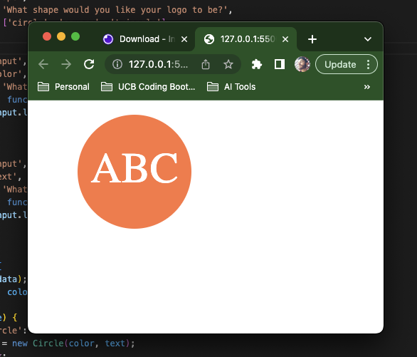

# Logo SVG Generator

## Table of Contents
- [Description](#description)
- [Installation](#installation)
- [Usage](#usage)
- [Technologies](#technologies)
- [Tests](#tests)
- [Questions](#questions)

[See it in action!](https://drive.google.com/file/d/1wprvBn1MH7npxpWyj2HmIyrxl2otcrtr/view)

## Description
A small node-based app that uses inquirer to ask the user a series of questions, and uses that input to generate an SVG file containing a logo based on their response.

## Installation
Clone the repo, cd into the directory, run 'npm i', and finally run 'node index'

## Usage
This program can be used to generate simple logos, finally rendering (heh) the entire graphic design profession obsolete.

## Technologies
- Node.js
- SVG
- Inquirer module
- fs module

## Tests
Jest is used to test all class constructors and methods.

## Questions

[My GitHub Profile](https://github.com/eschindev)

[Email me!](mailto:eschindler1993@gmail.com)